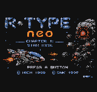
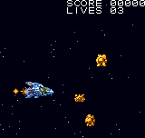
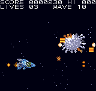

# R-Type Neo — Chapter 1: Star Rise

A side-scrolling shooter for the Neo Geo Pocket Color, built from scratch as
homebrew. Chapter 1 of a planned trilogy plus multicart-exclusive epilogue.

**Studio So Not Kansai** · underscore42



## The game

Ten sectors of increasingly dense combat leading to a three-phase encounter
with the Big Core. Three selectable ships, each with a distinct feel. Powerups
build your weapon from a single shot up to the wave cannon. Two continues.

**Enemies**

- **Drones** (4 types) — waves 1–2, drop powerups on kill
- **Small units** (6 types) — waves 3+, fire projectiles at you
- **Large units** (2 types) — mini-bosses that hover at the end of waves 2, 4,
  6, 8 and don't fly past; take multiple hits
- **Big Core** — three phases with distinct attack patterns; body on the
  scroll plane, sprite-plane arms and weak points

**Ships**

| Ship | Style | Notes |
|---|---|---|
| R-9A Arrowhead | Balanced | The classic |
| R-9D Shooting Star | Compact | Purple hull |
| R-9F Judgement | Aggressive | Green hull |



## Controls

| Button | Action |
|---|---|
| D-Pad | Move |
| A | Fire (hold for continuous) |
| B | Cancel / back |
| Option | Pause, or open Options from title |

**On the title screen**

- **A / Option** — start
- **Option** — Options menu (toggle B&W mode)
- **↑ ↑ ↓ ↓ ← → ← → B A** — Konami code, skips straight to the Big Core with
  maximum weapons

**On the ship select screen**

- **← → ↑ ↓** — choose ship
- **A / Option** — confirm
- **B** — back to title

## Running it

**On an emulator** — load `bin/rtype.ngp` in Mednafen, RetroArch (Beetle NGP
core), or NeoPop. The default Mednafen key mapping is WASD for the d-pad, Z
for A, X for B, Enter for Option.

**On real hardware** — the ROM is padded and headed for a flash cart. Tested
against the BIOS colour-mode check.

## Building from source

Toolchain: Toshiba TLCS-900H binaries (`cc900`, `tulink`, `tuconv`, `s242ngp`)
run under Wine on Linux, from the ngdevkit / ameliandev template family.

```
make clean && make          # builds bin/rtype.ngp
make run                    # builds and launches in Mednafen
```

`carthdr.h` sets `CartID` and the `System` byte for colour mode; if you're
retargeting to a different cart slot, adjust `CartID` there.

## Screenshots



## Trilogy

Chapter 1 is the first of four standalone releases:

- **Chapter 1: Star Rise** — space, Big Core *(this release)*
- **Chapter 2: Bydo Incursion** — Force Pod mechanic, organic corridors
- **Chapter 3: Star Fall** — beam charge, dynamic terrain
- **Epilogue: Final Strike** — multicart exclusive, true final boss

## Credits

**Design & code** — Steven (underscore42), Studio So Not Kansai

**Toolchain** — Toshiba TLCS-900H compiler suite; ameliandev's
[ngpc-project-template](https://github.com/ameliandev/ngpc-project-template)
framework

**Emulator** — Mednafen (development), RetroArch / Beetle NGP (testing)

**Sprite reference** — [The Spriter's Resource](https://www.spriters-resource.com/)
(base pixel art extracted for NGPC downscaling)

**Original R-Type** © Irem 1987. This is a non-commercial fan project and is
not affiliated with or endorsed by Irem or SNK.

## License

Source code released under the MIT License — see `LICENSE`.

R-Type, R-9A, R-9D, R-9F, and the Bydo are trademarks of Irem. Sprite artwork
is derivative fan work.
